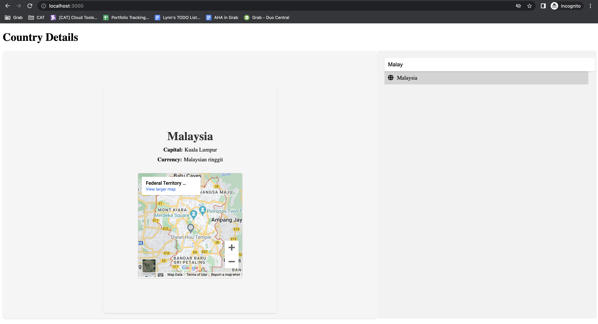
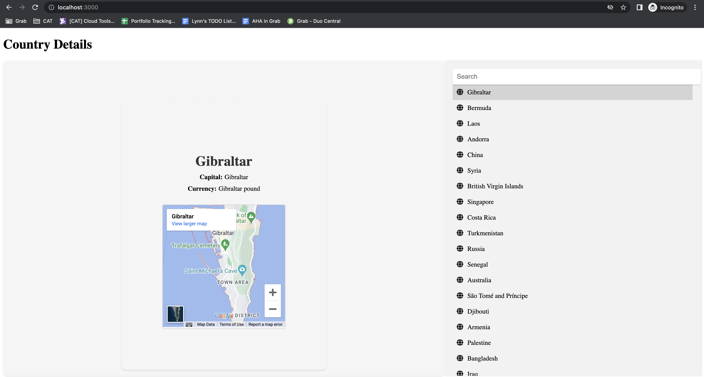

# Countries App
The Countries App is designed to provide detailed information about different countries.

## Getting Started

To get started with the app, follow these steps:

1. Replace the placeholder <b>'YOUR_API_KEY'</b> in the fetchMap function located in `countries-app/src/components/CountryDetails.js:26` with your actual Google Maps API key.

2. Run the command `npm start` in your terminal.
    This will start the app in the development mode.
    Open http://localhost:3000 to view it in your browser. 
    The page will automatically reload if you make any changes.
    You will also see any lint errors in the console.

## User Interface
Below are some sample screenshots of the app's user interface:

